# DB Visualizer

A comprehensive PostgreSQL database visualization and management tool built with React and NestJS. Explore, query, and manage your PostgreSQL databases through an intuitive web interface.

## 🎯 Overview

DB Visualizer is a full-featured database management application that provides a modern web interface for PostgreSQL databases. It offers powerful features for database exploration, query execution, schema visualization, and performance optimization.

## 🖼️ Visual Showcase

### Main Interface
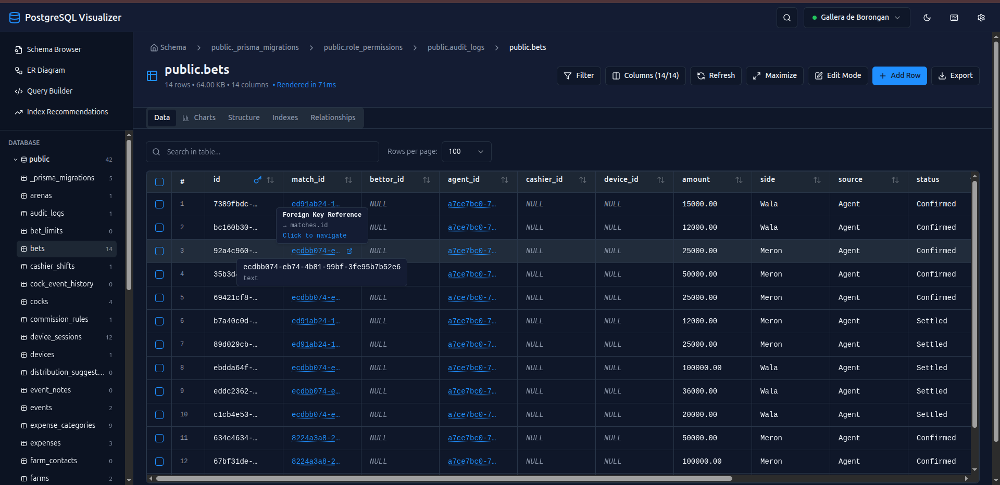

### Schema Browser
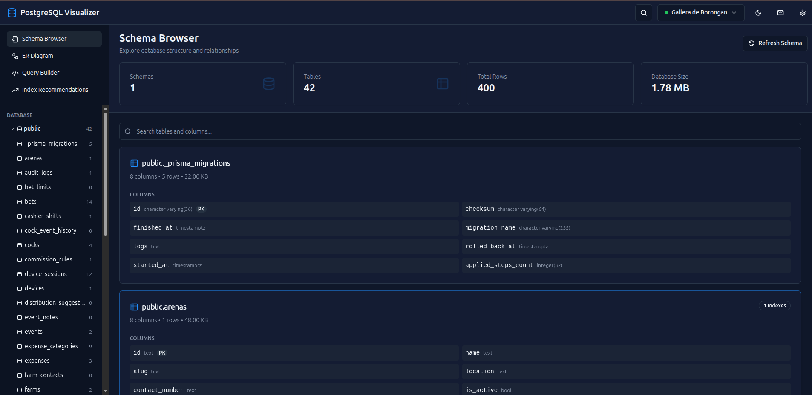

### ER Diagram


### Query Builder
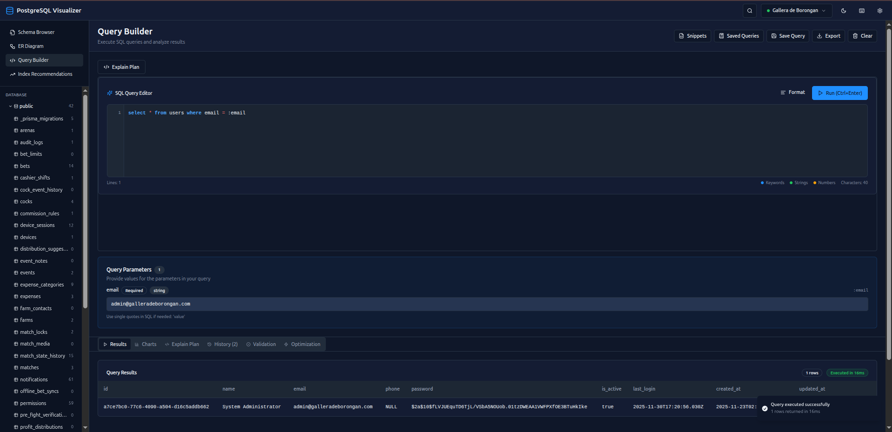

## ✨ Features

### 🔌 Connection Management

Securely manage multiple database connections with encrypted credential storage. Easily add, remove, and switch between databases without compromising security.

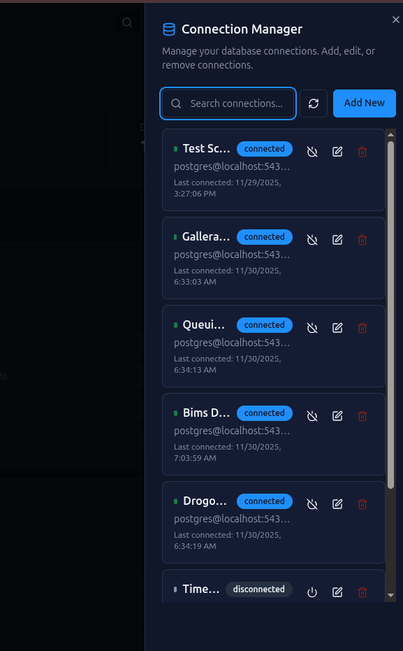

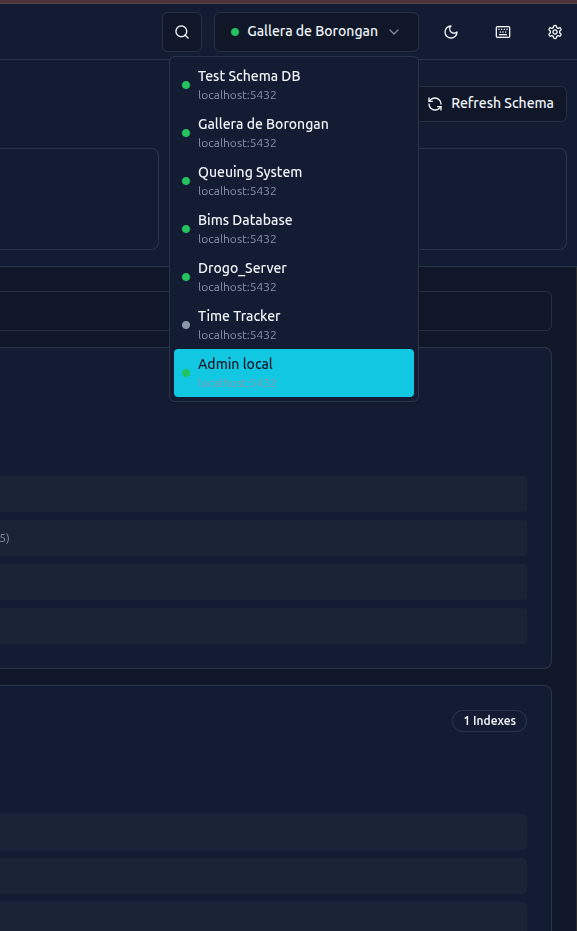

- **Encrypted Storage** - Database passwords encrypted using AES-256-CBC
- **Multiple Connections** - Connect to and switch between multiple databases simultaneously
- **Connection Testing** - Test connections before saving
- **Connection Persistence** - Saved connections persist across sessions

### 📊 Schema Browser

Explore database schemas, tables, columns, indexes, and relationships with an intuitive tree-based interface.


- **Schema Navigation** - Browse through schemas, tables, views, and functions
- **Table Details** - View column definitions, data types, constraints, and indexes
- **Relationship Visualization** - See foreign key relationships at a glance
- **Metadata Inspection** - Explore table statistics, row counts, and storage information
- **Quick Actions** - Right-click context menu for common operations

### 📋 Table Data Viewer

View and browse table data with powerful filtering, sorting, and search capabilities.

- **Pagination** - Efficiently navigate through large datasets
- **Advanced Filtering** - Filter data with multiple conditions (equals, contains, greater than, etc.)
- **Column Selection** - Show/hide columns as needed
- **Sorting** - Sort by any column in ascending or descending order
- **Global Search** - Search across all columns simultaneously
- **Data Editing** - Inline cell editing for quick data modifications
- **Foreign Key Navigation** - Click foreign key values to navigate to related tables

### 🔍 Query Builder

Execute SQL queries with a powerful query builder supporting both parameterized and unparameterized queries.


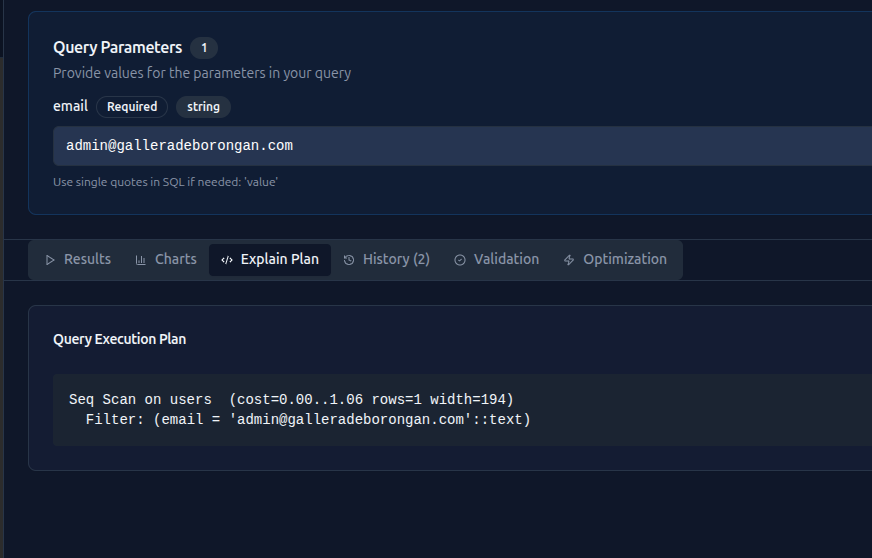

#### Query Execution Features
- **SQL Syntax Highlighting** - Beautiful syntax highlighting for better readability
- **Parameterized Queries** - Use named parameters (`:paramName`) in queries for safe execution
- **Query Validation** - Real-time SQL syntax validation with error highlighting
- **Query Execution** - Execute queries with configurable timeout and result limits
- **Result Visualization** - View query results in a sortable, filterable table

#### Query Analysis Features
- **EXPLAIN Plans** - Get detailed execution plans with `EXPLAIN` and `EXPLAIN ANALYZE`
- **Query Optimization** - Receive optimization suggestions based on execution plans
- **Execution Statistics** - View query execution time, row counts, and affected rows
- **Performance Analysis** - Identify slow queries and bottlenecks

#### Query Management Features
- **Query History** - Automatically track all executed queries with timestamps
- **Saved Queries** - Save frequently used queries for quick access
- **Query Snippets** - Library of reusable SQL snippets organized by category
- **Query Templates** - Use pre-built query templates for common operations

### 🗺️ ER Diagram Visualization

Interactive entity-relationship diagrams powered by ReactFlow with multiple layout options.


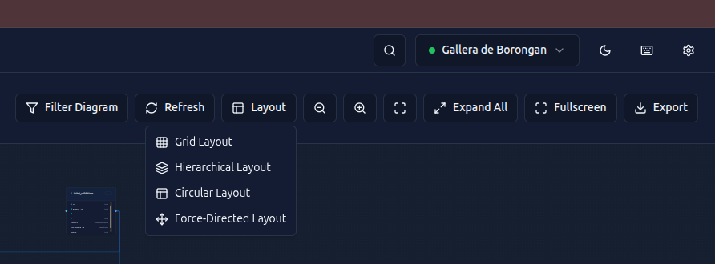

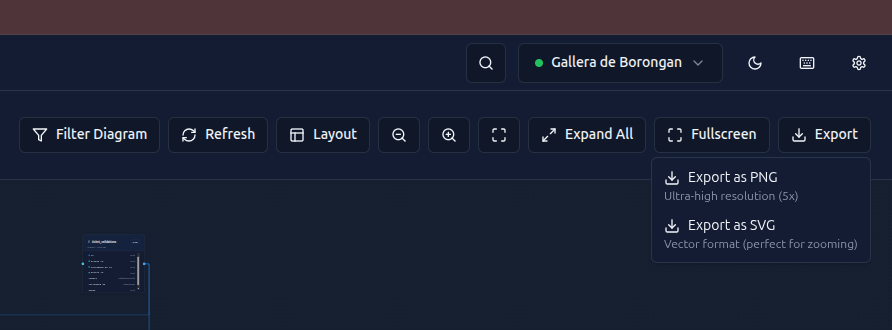

- **Interactive Diagrams** - Zoom, pan, and navigate through your database schema
- **Multiple Layout Algorithms**:
  - **Hierarchical** - Top-down layout showing table relationships
  - **Circular** - Circular arrangement of tables
  - **Grid** - Uniform grid layout
  - **Force-Directed** - Natural force-based positioning
- **Relationship Highlighting** - Hover over tables to highlight related entities
- **Table Expansion** - Expand/collapse table nodes to show/hide columns
- **Export Options** - Export diagrams as PNG or SVG for reports and documentation
- **Schema Filtering** - Filter tables and relationships by schema
- **Node Positioning** - Drag and drop to customize table positions
- **Minimap** - Navigate large diagrams with a minimap overview

### 📈 Data Visualization & Charts

Visualize query results and table data with interactive charts and graphs.

- **Chart Generation** - Create charts directly from query results
- **Multiple Chart Types** - Bar charts, line charts, pie charts, and more
- **Interactive Charts** - Zoom, pan, and interact with data visualizations
- **Chart Customization** - Customize colors, labels, and chart options
- **Data Export** - Export chart data along with visualizations

### 🔎 Global Search

Powerful search functionality across your entire database.

- **Cross-Table Search** - Search across multiple tables simultaneously
- **Column Name Search** - Find tables by column names
- **Data Value Search** - Search for specific data values across tables
- **Full-Text Search** - Advanced text search capabilities
- **Search Results Navigation** - Jump directly to matching records

### 🔐 Index Recommendations

Intelligent index recommendations based on query patterns and usage statistics.

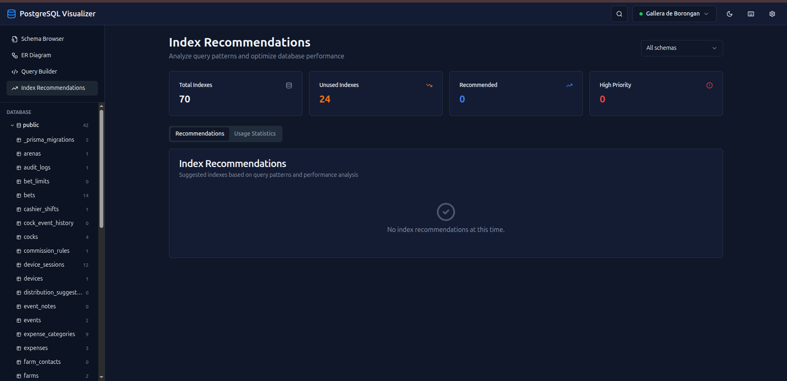

- **Query Pattern Analysis** - Analyze executed queries to identify optimization opportunities
- **Index Suggestions** - Get recommendations for new indexes
- **Usage Statistics** - View index usage statistics and performance metrics
- **Visual Analytics** - Charts showing recommended enhancements and usage statistics
- **Performance Impact** - Understand the expected performance improvement

### ⌨️ Keyboard Shortcuts & Command Palette

Powerful keyboard shortcuts and command palette for efficient navigation.

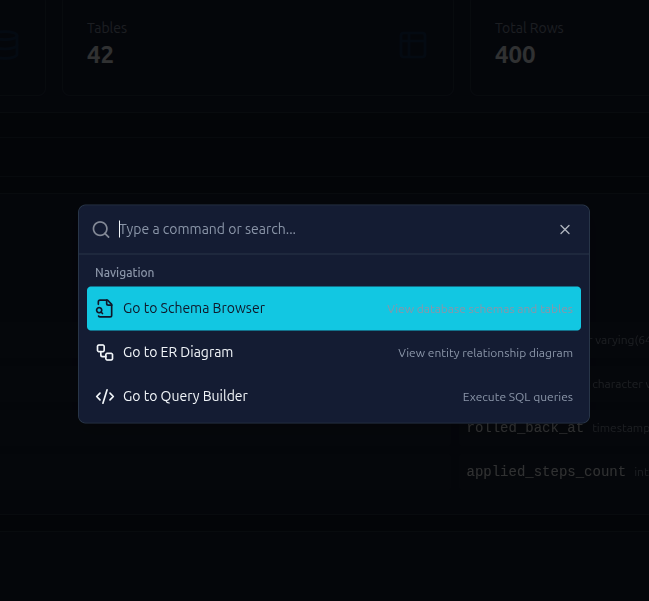

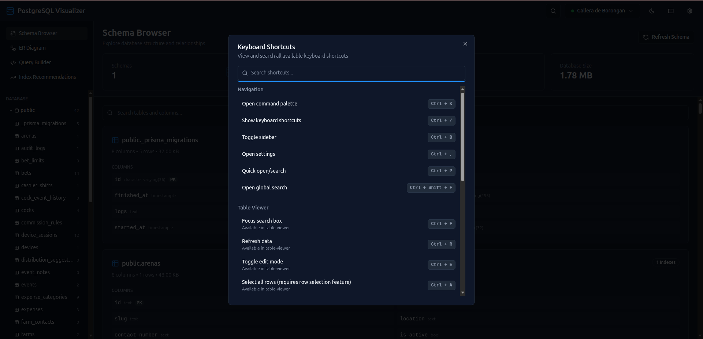

#### Command Palette
- **Quick Access** - Open with `Ctrl+K` or `Ctrl+P`
- **Navigation** - Quick navigation to Schema Browser, ER Diagram, Query Builder
- **Recent Commands** - Access recently used commands
- **Search** - Search through all available commands

#### Keyboard Shortcuts
- **Navigation Shortcuts**:
  - `Ctrl+K` / `Ctrl+P` - Open command palette
  - `Ctrl+/` - Show keyboard shortcuts
  - `Ctrl+B` - Toggle sidebar
  - `Ctrl+,` - Open settings
  - `Ctrl+Shift+F` - Global search
- **Query Builder Shortcuts**:
  - `Ctrl+Enter` - Execute query
  - `Ctrl+S` - Save query
  - `Ctrl+L` - Clear query
  - `F5` - Format query
- **Table Viewer Shortcuts**:
  - `Ctrl+F` - Search in table
  - `Ctrl+R` - Refresh data
- **Editor Shortcuts**:
  - Standard text editor shortcuts
  - `Ctrl+/` - Comment/uncomment lines

### 📤 Data Export

Export data in multiple formats for reporting and analysis.

- **CSV Export** - Export table data or query results as CSV files
- **JSON Export** - Export data as JSON for programmatic use
- **ER Diagram Export** - Export ER diagrams as PNG or SVG
- **Filtered Export** - Export filtered and sorted data
- **Full Database Export** - Export complete database dumps (with or without data)

### 🔗 Foreign Key Navigation

Navigate relationships between tables seamlessly.

- **Relationship Navigation** - Click foreign key values to jump to related tables
- **Bidirectional Navigation** - Navigate both forward and backward relationships
- **Relationship Visualization** - Visual indicators for foreign key relationships
- **Quick Access** - Quick access to related data without writing queries

### 🔧 Additional Features

- **Query Snippets Library** - Organized collection of reusable SQL snippets
- **Real-time Validation** - Instant feedback on SQL syntax errors
- **Connection Pooling** - Efficient database connection management
- **Result Pagination** - Handle large result sets efficiently
- **Query Cancellation** - Cancel long-running queries
- **Error Handling** - Comprehensive error messages and handling
- **Dark Mode** - Beautiful dark theme support
- **Responsive Design** - Works seamlessly on different screen sizes

## 🛠️ Technology Stack

### Frontend
- **React 18** - UI framework
- **TypeScript** - Type safety
- **Vite** - Build tool and dev server
- **React Query (TanStack Query)** - Server state management
- **shadcn-ui** - UI component library
- **Tailwind CSS** - Styling
- **React Router** - Routing
- **ReactFlow** - ER diagram visualization
- **Recharts** - Data visualization

### Backend
- **NestJS** - Node.js framework
- **TypeScript** - Type safety
- **PostgreSQL (pg)** - Database client
- **class-validator** - Input validation
- **AES-256-CBC** - Password encryption

## 🚀 Quick Start

### Prerequisites

- **Node.js** 18+ and npm
- **PostgreSQL** database (for testing connections)

### Installation

1. **Clone the repository**
   ```bash
   git clone <repository-url>
   cd db-visualizer
   ```

2. **Backend Setup**
   ```bash
   cd backend
   npm install
   
   # Create .env file
   cp env.template .env
   
   # Generate encryption key
   openssl rand -base64 32
   # Add the generated key to .env as ENCRYPTION_KEY
   ```

3. **Frontend Setup**
   ```bash
   cd frontend
   npm install
   
   # Create .env file (optional)
   echo "VITE_API_URL=http://localhost:3000/api" > .env
   ```

### Running the Application

**Option 1: Using the start script (recommended)**
```bash
# From project root
chmod +x _scripts/start-dev.sh
./_scripts/start-dev.sh
```

**Option 2: Manual start**
```bash
# Terminal 1 - Backend
cd backend
npm run start:dev

# Terminal 2 - Frontend
cd frontend
npm run dev
```

The application will be available at:
- **Frontend:** http://localhost:8080 or http://localhost:5173
- **Backend API:** http://localhost:3000/api

### First Steps

1. Open the application in your browser
2. Click the Settings icon to open Connection Manager
3. Create a new database connection
4. Test and connect to your database
5. Start exploring your schemas and tables!

## 📁 Project Structure

```
db-visualizer/
├── backend/                 # NestJS backend API
│   ├── src/
│   │   ├── connections/     # Connection management
│   │   ├── schemas/         # Schema & metadata
│   │   ├── data/            # Table data operations
│   │   ├── queries/         # Query execution
│   │   ├── query-history/   # Query history & saved queries
│   │   ├── query-snippets/  # Query snippets management
│   │   ├── diagram/         # ER diagram generation
│   │   ├── export/          # Data export
│   │   ├── foreign-keys/    # Foreign key navigation
│   │   ├── index-recommendations/ # Index analysis
│   │   ├── search/         # Global search
│   │   ├── charts/         # Chart generation
│   │   └── common/         # Shared utilities
│   ├── database/           # File storage (connections, history)
│   └── dist/               # Compiled output
├── frontend/               # React frontend
│   ├── src/
│   │   ├── components/     # React components
│   │   ├── pages/          # Page components
│   │   ├── lib/            # Utilities & API client
│   │   ├── hooks/          # Custom React hooks
│   │   └── contexts/       # React contexts
│   └── dist/              # Build output
├── _docs/                 # Documentation files
├── _scripts/               # Utility scripts
└── README.md              # This file
```

## 📚 Documentation

### Getting Started
- **[_docs/SETUP_GUIDE.md](./_docs/SETUP_GUIDE.md)** - Complete setup and installation guide

### Frontend Documentation
- **[_docs/FRONTEND_INTEGRATION_README.md](./_docs/FRONTEND_INTEGRATION_README.md)** - Frontend-backend integration guide
- **[_docs/API_SERVICE_DOCUMENTATION.md](./_docs/API_SERVICE_DOCUMENTATION.md)** - Frontend API service reference
- **[_docs/STATE_MANAGEMENT_DOCUMENTATION.md](./_docs/STATE_MANAGEMENT_DOCUMENTATION.md)** - State management patterns and best practices
- **[frontend/README.md](./frontend/README.md)** - Frontend-specific documentation

### Backend Documentation
- **[backend/README.md](./backend/README.md)** - Backend overview and quick start
- **[backend/_docs/API_DOCUMENTATION.md](./backend/_docs/API_DOCUMENTATION.md)** - Complete API endpoint reference
- **[backend/_docs/ARCHITECTURE.md](./backend/_docs/ARCHITECTURE.md)** - System architecture and design patterns
- **[backend/_docs/DEPLOYMENT.md](./backend/_docs/DEPLOYMENT.md)** - Production deployment guide

## 🔧 Development

### Available Scripts

**Backend:**
```bash
cd backend
npm run start:dev    # Development server with hot reload
npm run build        # Build for production
npm run start:prod   # Production server
npm run lint         # Run ESLint
npm test             # Run tests
```

**Frontend:**
```bash
cd frontend
npm run dev          # Development server
npm run build        # Build for production
npm run preview      # Preview production build
npm run lint         # Run ESLint
```

### Environment Variables

**Backend (.env):**
```env
PORT=3000
NODE_ENV=development
FRONTEND_URL=http://localhost:5173
ENCRYPTION_KEY=<your-encryption-key>
```

**Frontend (.env):**
```env
VITE_API_URL=http://localhost:3000/api
```

### Code Structure

The application follows a modular architecture:

- **Backend:** Feature-based modules with NestJS dependency injection
- **Frontend:** Component-based architecture with React Query for state management
- **API Communication:** Centralized API client with type-safe services
- **State Management:** React Query for server state, React Context for global client state

## 🔒 Security

- **Password Encryption:** Database passwords are encrypted using AES-256-CBC before storage
- **SQL Injection Prevention:** All queries use parameterized statements
- **Input Validation:** All API endpoints validate input using class-validator
- **CORS:** Configured to allow requests only from the frontend origin

## 🧪 Testing

### Backend Tests
```bash
cd backend
npm test              # Unit tests
npm run test:e2e      # End-to-end tests
npm run test:cov      # Coverage report
```

### Frontend Tests
```bash
cd frontend
# Test pages available at:
# - /api-test
# - /state-test
# - /ui-ux-test
```

## 📦 Building for Production

### Backend
```bash
cd backend
npm run build
npm run start:prod
```

### Frontend
```bash
cd frontend
npm run build
# Output in frontend/dist/
```

## 🤝 Contributing

1. Follow TypeScript best practices
2. Use dependency injection (NestJS DI)
3. Always validate input with DTOs
4. Use parameterized queries (prevent SQL injection)
5. Handle errors gracefully
6. Write tests for new features

## 📄 License

MIT

## 🙏 Acknowledgments

Built with modern web technologies to provide a powerful and intuitive database management experience.

---

**For detailed setup instructions, see [_docs/SETUP_GUIDE.md](./_docs/SETUP_GUIDE.md)**

